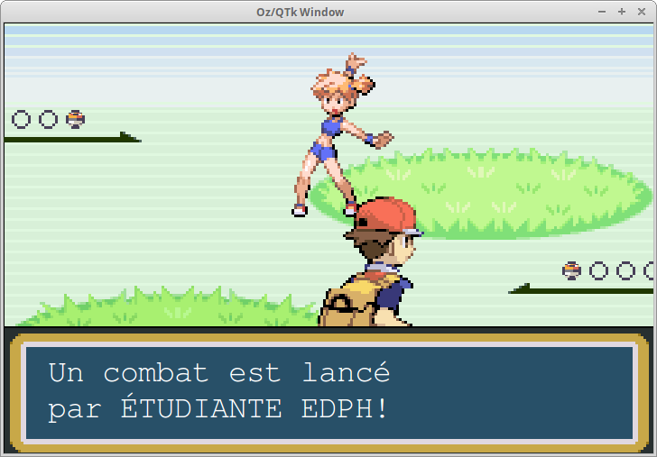

# PokemOZ

PokemOZ is a Pokemon fan-game made in 2015 for an IT UCL course. The game is written with the functional programming language Mozart/Oz. I made it all by myself (except the big part of the resources), and I got the maximum of points for the code. No modification has been made since the submission. Enjoy!

### Screenshots

### Execution

    ozengine PokemOZ.ozf -m [map file] -p [probability] -s [speed] -a [autofight] -t [admin]

### Possible values

    [map file] : Map, Map2, Map3, Map4
        default: Map
    [probability] : Value between 0 and 10
    [speed] : Same, Range [0:10]
    [autofight] : normal (never automatic)
                  fight (automatic)
                  run (always trying to run during battle against wild PokemOZ)
                  intel (IA, but at this time not complete, so poor IA)
                  default: fight
    [admin] : test (skips the title screen, add gives you all the game's PokemOZ, the first one being the stronger one)

### Exemples 
 
    - ozengine PokemOZ.ozf -m Map3 -p 1 -s 8 -a fight
    - ozengine PokemOZ.ozf -m Map -a normal -t test

### Keys

    -Enter       Continue (only during title screen)
    -w           Accept, acquiesce, select, go next
    -x           Refuse, go back
    -arrow keys  Move
    -s           Pressed in the beginning of the game: skip optional scenes
    -r           Change autofight to 'run' (cannot undo during a fight)
    -f           Change autofight to 'fight' (cannot undo during a fight)
    -i           Change autofight to 'intel' (cannot undo during a fight)
    -n           Change autofight to 'normal'
    
    The followings were not tested:
    -v           Increase speed's value
    -Control_L   Decrease speed's value
    -p           Increase probability's value
    -Shift_L     Decrease probability's value

### Map

    If you're moving in the field vision of a student, then he comes "speak" 
    to you. (In the same way, if you're not moving, even if you're in his 
    field vision, he lets you go)
    If you walk on the grass and if the Probability parameter > 0, then a 
    wild PokemOZ can attack you.

### Fight

    You can either run or capture a wild PokemOZ, change or recover your 
    fighting PokemOZ, or simply attack your opponent.

### Capture
    
    The more high the level and the HP of the wild PokemOZ are, the more 
    difficult is his capture and your run's attempt, and so high is his 
    attack's level of efficency.
